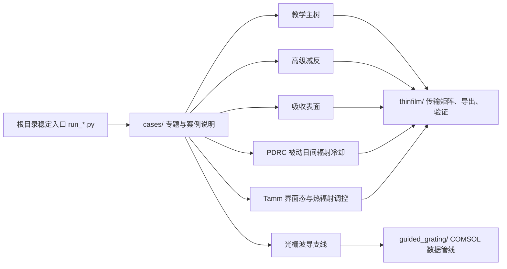

# 薄膜光学 Python 平台

当前仓库聚焦两条工作线：

1. 教学仿真主树  
   用 Python 复现设计报告中的平面多层膜正向仿真，并为展示或 APP 提供后端。
2. 光栅波导研究支线  
   从异构薄膜扩展到周期光栅、波导共振与窄线宽反射镜设计。

原有反演主线和样本数据已从仓库主工作流中移出，不再作为当前仓库内的主要维护对象。

## 快速开始

```bash
pip install -r requirements.txt
python smoke_test.py
python run_teaching_demo.py --case single_ar
python run_guided_grating_demo.py
```

默认输出目录为 `~/thinfilm_outputs`，也可以通过环境变量 `THINFILM_OUTPUT_DIR` 指定。

## 1. 当前边界

当前统一约定：

```text
教学平台只展示教学主树
不暴露厚度反演入口
仓库内不再保留反演样本 CSV
```

这意味着：

- 教学平台面向“正向仿真、演示、导出、验证”
- 光栅波导支线继续作为研究模块保留
- 旧反演样本已备份到本机仓库外目录，不再留在项目目录中

## 2. 目录概览

```text
README.md                    项目总说明
run_*.py                     根目录稳定入口，只负责转发
cases/                       各专题和具体案例的运行脚本与说明
thinfilm/                    薄膜光学核心库、教学主树、验证模块
guided_grating/              光栅波导研究支线库
data/                        数据路径说明目录
archive/                     历史归档与非主线材料
requirements.txt             Python 环境依赖
smoke_test.py                最小导入与演示命令体检
```

推荐从外向内理解仓库：

```text
根目录 run_*.py      给老师、组员、评委和 CI 使用的稳定入口
cases/*/run_*.py    具体专题内部脚本
cases/*/*/README.md 具体案例说明页
thinfilm/           底层薄膜光学模型、导出、验证和数据分析函数
guided_grating/     光栅波导支线函数库
```

根目录入口会通过 `_entrypoint_runner.py` 转发到 `cases/` 内部脚本。这样旧命令仍然稳定，同时仓库展示层也能按专题和案例阅读。

## 2.1 模块路线图



`thinfilm/` 当前重点模块：

```text
thinfilm/api.py
thinfilm/education.py
thinfilm/io.py
thinfilm/validation.py
thinfilm/paths.py
```

`guided_grating/` 当前重点模块：

```text
guided_grating/comsol_io.py
guided_grating/models.py
guided_grating/spectra.py
guided_grating/export.py
guided_grating/examples.py
```

## 3. 教学仿真主树

### 3.0 最小体检

合并代码或准备展示前，建议先运行：

```bash
python smoke_test.py
```

它会检查 `thinfilm` 与 `guided_grating` 的导入，并跑通教学主树和光栅波导支线的最小命令。

仓库还提供 GitHub Actions 工作流 `.github/workflows/smoke.yml`，用于在 push 和 pull request 时自动运行同一套最小体检。

### 3.1 目标

教学主树用于复现设计报告中的平面多层膜正向仿真，当前覆盖：

1. 单层减反射膜
2. 双层减反射膜
3. 三层减反射膜
4. 高反射膜
5. 单半波型 F-P 滤光片
6. 双半波型 F-P 滤光片
7. 中性分束膜

底层方法为传输矩阵法 / 特征矩阵法，不依赖 COMSOL 即可快速生成 `R / T / A` 曲线。

### 3.1.1 扩展案例

除了基础教学案例外，当前主树还补充了一组更适合做专题展示和后续验证的扩展案例：

1. `quarter_wave_single_layer`：`1/4` 波长单层膜
2. `half_wave_single_layer`：`1/2` 波长单层膜
3. `quarter_wave_double_layer`：`1/4` 波长双层膜系
4. `quarter_wave_stack`：`1/4` 波长 QW 膜堆
5. `bragg_reflector`：布拉格反射镜
6. `fp_filter`：标准 F-P 滤光片
7. `narrowband_filter`：窄带滤光片
8. `rugate_filter`：皱褶滤光片
9. `porous_sio2_layer`：多孔二氧化硅膜层
10. `moth_eye_effective_gradient`：蛾眼结构（等效渐变层）

当前还配套提供了扩展案例对比图：

- `quarter_wave_stack_periods`
- `narrowband_filter_periods`

### 3.2 命令行入口

列出案例：

```bash
python run_teaching_demo.py --list
```

导出单个案例：

```bash
python run_teaching_demo.py --case single_ar
```

导出对比图：

```bash
python run_teaching_demo.py --compare
```

导出目录配置：

```bash
python run_teaching_demo.py --catalog
```

导出完整主树报告包：

```bash
python run_teaching_demo.py --report
```

### 3.3 当前可导出的内容

当前已具备：

1. 单案例导出
2. 第 2 章整套案例导出
3. 多曲线对比图导出
4. 主树总包导出
5. 主树目录配置导出
6. 参数面板自动渲染所需 JSON 配置
7. 单案例分析图 `analysis_png`
8. 对比图分析图 `analysis_png`

常见输出包括：

```text
teaching_case_*_spectrum.csv
teaching_case_*_summary.json
teaching_case_*_summary.txt
teaching_case_*_RTA.png
teaching_case_*_main.png
teaching_case_*_analysis.png
teaching_compare_*.csv
teaching_compare_*.png
teaching_compare_*_analysis.png
teaching_main_branch_catalog.json
```

### 3.4 扩展案例验证模板

### 3.4.1 生成扩展案例验证模板

导出模板：

```bash
python run_teaching_expansion_validation.py --template-out --prefix teaching_expansion_validation_cli
```

填写模板中的 `reference_csv` 等字段后，可以直接运行：

```bash
python run_teaching_expansion_validation.py --template-file "path/to/filled_template.json" --prefix teaching_expansion_validation_run
```

模板支持 `.json` 或 `.csv` 两种格式。

这套模板的作用是先把“理论案例”和“未来会接入的 COMSOL 参考曲线”之间的映射关系固定下来。

推荐接口：

```python
from thinfilm import (
    build_teaching_expansion_validation_templates,
    export_teaching_expansion_validation_template_bundle,
)
```

模板里会预生成这些信息：

- 推荐比较量 `R / T`
- 建议 CSV 主列选择器，如 `R (1)` 或 `T (1)`
- 默认参数覆盖项
- 未来 COMSOL / 实验曲线的接入占位

当前支持：

- `quarter_wave_single_layer`
- `half_wave_single_layer`
- `quarter_wave_double_layer`
- `quarter_wave_stack`
- `bragg_reflector`
- `fp_filter`
- `narrowband_filter`
- `rugate_filter`
- `porous_sio2_layer`
- `moth_eye_effective_gradient`

导出模板示例：

```python
from thinfilm import export_teaching_expansion_validation_template_bundle

files = export_teaching_expansion_validation_template_bundle(
    prefix="teaching_expansion_validation_templates_v1"
)
print(files)
```

## 4. 理论-参考曲线验证

当前仓库已保留验证模块，用于把理论曲线与 COMSOL / 实验曲线做直接对照。

可直接导入：

```python
from thinfilm import (
    compare_teaching_case_to_reference,
    export_teaching_validation_result,
    run_teaching_validation_suite,
    export_teaching_validation_suite_summary,
)
```

适合当前优先做的三类验证对象：

1. 单层减反膜
2. F-P 滤光片
3. 高反膜

输出重点：

- 理论曲线
- 参考曲线
- 误差曲线
- `MAE / RMSE / 最大绝对误差 / lambda0 处误差`

## 5. 光栅波导研究支线

### 5.1 路线定位

该支线用于承接：

```text
异构薄膜
-> 周期光栅
-> 波导共振
-> 窄线宽反射镜设计
```

当前光栅波导支线不是独立 RCWA/FEM 物理求解器。占位求解器只用于验证工程骨架和导出链路；正式物理结果来自 COMSOL CSV，Python 负责数据读取、峰位提取、FWHM、参数筛选和可视化。

### 5.2 命令行入口

运行最小占位示例：

```bash
python run_guided_grating_demo.py
```

读取 COMSOL 单条光谱：

```bash
python run_guided_grating_demo.py --csv "path/to/Grant.csv"
```

读取 `lambda + period` 联合扫描：

```bash
python run_guided_grating_demo.py --sweep-csv "path/to/2d.csv" --target-wavelength 1550
```

读取 `lambda + t_wg` 联合扫描：

```bash
python run_guided_grating_demo.py --sweep-csv "path/to/7new.csv" --sweep-name t_wg --target-wavelength 1550
```

读取 `lambda + fill_factor` 联合扫描：

```bash
python run_guided_grating_demo.py --sweep-csv "path/to/8new.csv" --sweep-name fill_factor --target-wavelength 1550
```

### 5.3 当前阶段性设计点

截至当前，已锁定一个可工作的无损近似设计点：

```text
period = 980 nm
t_wg = 220 nm
fill_factor = 0.55
peak_wavelength ≈ 1550.0 nm
R_peak ≈ 0.99999985
FWHM ≈ 9.6 nm
```

后续仍建议继续补：

1. 吸收与损耗影响
2. `t_grating` 的系统影响
3. 模态机理解释
4. 工艺容差分析

## 6. 输出目录

所有默认输出写入到环境变量 `THINFILM_OUTPUT_DIR` 指定的目录；如果未设置，则写入用户主目录下的 `thinfilm_outputs/`：

```text
~/thinfilm_outputs
```

光栅支线常见输出包括：

```text
guided_grating_*_summary.json
guided_grating_*_summary.txt
guided_grating_*_main.png
guided_grating_*_RTA.png
guided_grating_*_error_analysis.png
guided_grating_*_period_summary.csv
```

## 7. 已移出的反演样本

仓库内原反演样本 CSV 已移出项目目录；如需复查旧数据，请使用仓库外的个人备份，不再把样本 CSV 放回当前主工作流。

## 8. 环境依赖

安装依赖：

```bash
pip install -r requirements.txt
```

缓存与输出忽略规则见：

```text
.gitignore
```

## 9. 一键生成验证与性能总包

如果已经准备好三类 COMSOL CSV：

1. 单层减反膜
2. F-P 滤光片
3. 高反膜

可以直接运行：

```bash
python run_teaching_metrics_bundle.py \
  --single-ar-csv "path/to/single_ar.csv" \
  --fp-csv "path/to/fp_filter.csv" \
  --high-reflector-csv "path/to/high_reflector.csv" \
  --prefix teaching_pipeline_v1
```

该脚本会自动生成：

- 理论 vs COMSOL 验证总包
- 分辨率与噪声敏感性结果
- 系统误差结果
- 分层厚度敏感性结果
- 精细厚度容差结果
- 精细角度容差结果
- 综合性能总表
- 竞赛口径中文总结

当前验证导出已统一包含：

- `comparison.csv`：理论、参考与误差逐点对照
- `summary.json`：包含 `summary`、`core_metrics`、`core_metrics_cn`
- `summary.txt`：中文核心指标摘要
- `main.png`：主对照图
- `analysis.png`：误差分析图

如果希望在 Python 中直接调用，也可以使用：

```python
from pathlib import Path
from thinfilm import export_final_delivery_bundle

result = export_final_delivery_bundle(
    single_ar_csv=Path("path/to/single_ar.csv"),
    fp_single_csv=Path("path/to/fp_filter.csv"),
    high_reflector_csv=Path("path/to/high_reflector.csv"),
    prefix="teaching_final_delivery_v1",
    reference_label="COMSOL",
)
```

## 10. 高级减反专题总包

当前仓库已支持一个独立的“高级减反专题”总包，用于并列展示：

1. 单层减反膜
2. 多孔二氧化硅膜层
3. 蛾眼结构（等效渐变层）
4. 2D 蛾眼梯形结构 COMSOL 参考曲线

命令行入口：

```bash
python run_advanced_ar_bundle.py \
  --single-ar-csv "path/to/single_ar.csv" \
  --porous-csv "path/to/porous.csv" \
  --moth-eye-effective-csv "path/to/moth_eye_effective.csv" \
  --moth-eye-2d-csv "path/to/moth_eye_2d.csv" \
  --prefix advanced_ar_topic_v1
```

Python 入口：

```python
from pathlib import Path
from thinfilm import export_advanced_ar_topic_bundle

result = export_advanced_ar_topic_bundle(
    single_ar_csv=Path("path/to/single_ar.csv"),
    porous_csv=Path("path/to/porous.csv"),
    moth_eye_effective_csv=Path("path/to/moth_eye_effective.csv"),
    moth_eye_2d_csv=Path("path/to/moth_eye_2d.csv"),
    prefix="advanced_ar_topic_v1",
    reference_label="COMSOL",
)
```

该总包会自动导出：

- 四个主题的单独理论对照结果
- 专题总览图
- 综合摘要 CSV / JSON / TXT
- Manifest 清单

## 11. 前沿研究模型树

当前仓库除了教学主树和研究支线外，还新增了一棵**前沿研究模型树**，用于承接不适合直接放进教学主树首页、但需要正式组织推进的创新模块。

当前已开启模块：

1. 拓扑 Tamm 边界态与热辐射空间调控

该模块当前按三层推进：

1. 普通 Tamm 吸收器
2. 反射相位与拓扑分类
3. 拓扑 Tamm 边界态与空间调控

当前状态：

- 第 1 层普通 Tamm 吸收器已完成一轮主参数摸底，当前最佳点已推进到 `d_W = 120 nm`
- 已确认 `d_W` 是关键参数，且在 `10~120 nm` 范围内吸收持续增强并接近完美吸收
- 第 2 层反射相位与拓扑分类已启动，并已具备第一版相位分析总包
- 第 3 层边界态与空间调控仍保留为后续阶段

当前还支持一个第 2 阶段的最小相位分析入口，可直接对包含 `atan2(imag(S11), real(S11))` 列的 `d_W` 联合扫描 CSV 进行处理：

```bash
python run_tamm_phase_bundle.py \
  --csv "path/to/tamm_spectrum_dW_scan.csv" \
  --prefix tamm_dw_phase_v1
```

导出前沿模型树：

```bash
python run_frontier_model_tree.py
```

导出带清单的总包：

```bash
python run_frontier_model_tree.py --bundle
```

Python 入口：

```python
from thinfilm import (
    get_frontier_model_tree,
    export_frontier_model_tree,
    export_frontier_model_bundle,
)
```
