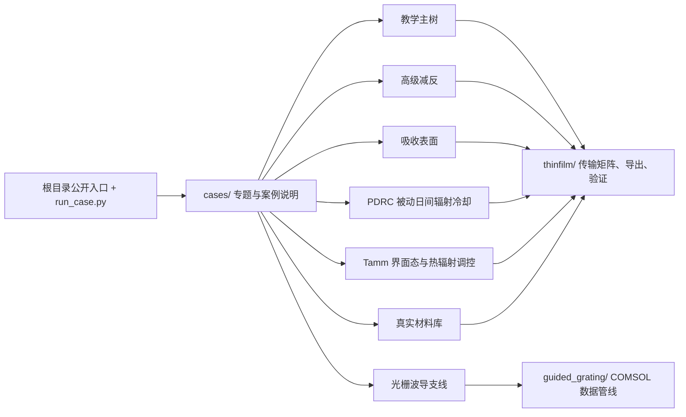

# 薄膜光学 Python 平台

> **基于 Python、TMM 与 RCWA 的薄膜光学仿真、设计与教学平台，不依赖 COMSOL。**

本项目聚焦两条工作线：

1. 教学仿真主树  
   用 Python 复现设计报告中的平面多层膜正向仿真，并为展示或 APP 提供后端。
2. 光栅波导研究支线  
   从异构薄膜扩展到周期光栅、波导共振与窄线宽反射镜设计。

**核心特点**：
- 完全自主的 TMM/RCWA 求解器，不依赖 COMSOL
- 270 个单元测试保证计算正确性
- 5 个 TMM-only 工程应用案例
- Plotly 交互式图表
- 教育内容模块（参数说明、设计原理、公式库）

原有反演主线和样本数据已从仓库主工作流中移出，不再作为当前仓库内的主要维护对象。

## 快速开始

```bash
pip install -r requirements.txt
python smoke_test.py
python run_teaching_demo.py --case single_ar
python run_guided_grating_demo.py
python run_material_library_demo.py
```

默认输出目录为 `~/thinfilm_outputs`，也可以通过环境变量 `THINFILM_OUTPUT_DIR` 指定。

## 0. 测试

运行全部测试（270 个用例）：

```bash
python -m pytest tests/ -v
```

快速验证（仅 TMM 核心）：

```bash
python -m pytest tests/test_tmm_core.py -q
```

性能基线：

```bash
python benchmarks/performance_baseline.py
```

## 1. 当前边界

当前统一约定：

```text
教学平台只展示教学主树
不暴露厚度反演入口
仓库内不再保留反演样本 CSV
```

这意味着：

- 教学平台面向“正向仿真、演示、导出、验证”
- 光栅波导支线继续作为研究模块保留
- 旧反演样本已备份到本机仓库外目录，不再留在项目目录中

## 2. 目录概览

```text
README.md                    项目总说明
run_*.py                     根目录稳定入口，只负责转发
run_case.py                  高级专题统一入口，转发到 cases/*/run_*.py
cases/                       各专题和具体案例的运行脚本与说明
thinfilm/                    薄膜光学核心库、教学主树、验证模块
guided_grating/              光栅波导研究支线库
data/                        数据路径说明目录
archive/                     历史归档与非主线材料
requirements.txt             Python 环境依赖
smoke_test.py                最小导入与演示命令体检
```

推荐从外向内理解仓库：

```text
根目录公开 run_*.py  给老师、组员、评委和 CI 使用的少量稳定入口
run_case.py          高级专题统一入口
cases/*/run_*.py    具体专题内部脚本
cases/*/*/README.md 具体案例说明页
thinfilm/           底层薄膜光学模型、导出、验证和数据分析函数
guided_grating/     光栅波导支线函数库
```

根目录只保留少量公开入口：

```text
run_teaching_demo.py
run_material_library_demo.py
run_teaching_metrics_bundle.py
run_guided_grating_demo.py
run_frontier_model_tree.py
```

其他高级专题通过 `run_case.py` 统一调用，例如：

```bash
python run_case.py --list
python run_case.py --group tamm --case phase_bundle -- --csv "path/to/tamm_scan.csv"
python run_case.py --group pdrc --case cooling_bundle -- --comsol-csv "path/to/pdrc.csv"
python run_case.py --group advanced_ar --case bundle -- --single-ar-csv "path/to/single_ar.csv"
```

`data/` 当前按数据来源分为三层：

```text
data/real_nk/        RefractiveIndex.INFO 真实材料 n(lambda), k(lambda)
data/real_spectrum/  公开实测反射谱数据说明与后续接入口
data/comsol/         COMSOL 导出数据的专题说明
data/theory/         Python TMM 生成理论谱线说明
```

推荐对外表述为：理论数据用于验证算法，COMSOL 数据用于验证复杂结构，公开真实数据用于引入真实材料色散和真实测量谱线。真实材料库已通过 `thinfilm/materials.py` 统一接入，可用于读取、插值、导出材料目录，并在教学 TMM 中切换为真实色散计算。

## 2.1 模块路线图



PDRC 当前已完成真实材料宽波段验证：`d_SiO2_1 = 200 nm`、`d_SiO2_2 = 500 nm`、`d_TiO2_1 = d_TiO2_2 = 440 nm`、`d_SiO2_3 = 1000 nm`、`Ag = 500 nm`。该结构在最新 COMSOL 真实材料导出中得到 `A_solar_weighted(ASTM G173) = 0.0435`、`R_solar_weighted(ASTM G173) = 0.9565`、`epsilon_8_13_avg = 0.8044`、`cooling_score_weighted(ASTM G173) = 0.7609`，满足太阳波段低吸收与 `8-13 um` 红外窗口高发射的第一版标准。

`thinfilm/` 当前重点模块：

```text
thinfilm/api.py
thinfilm/education.py
thinfilm/materials.py
thinfilm/io.py
thinfilm/validation.py
thinfilm/paths.py
```

`guided_grating/` 当前重点模块：

```text
guided_grating/comsol_io.py
guided_grating/models.py
guided_grating/spectra.py
guided_grating/export.py
guided_grating/examples.py
```

## 3. 教学仿真主树

### 3.0 真实材料库

真实材料光学常数统一放在 `data/real_nk/`，代码入口为：

```python
from thinfilm import (
    list_real_materials,
    material_nk_at,
    simulate_teaching_design_real_materials,
)
```

命令行演示：

```bash
python run_material_library_demo.py
```

该命令会导出材料覆盖范围、常用波长 `n/k` 采样表，以及 `single_ar`、`bragg_reflector`、`fp_filter` 的常数折射率 TMM 与真实色散 TMM 对照。注意：真实材料只能在数据源覆盖范围内使用，当前 Johnson-Christy Au/Ag 不覆盖中红外，不能直接外推到 `8-13 um` PDRC 或 `4-5 um` Tamm。

### 3.1 最小体检

合并代码或准备展示前，建议先运行：

```bash
python smoke_test.py
```

它会检查 `thinfilm` 与 `guided_grating` 的导入，并跑通教学主树和光栅波导支线的最小命令。

仓库还提供 GitHub Actions 工作流 `.github/workflows/smoke.yml`，用于在 push 和 pull request 时自动运行同一套最小体检。

### 3.2 目标

教学主树用于复现设计报告中的平面多层膜正向仿真，当前覆盖：

1. 单层减反射膜
2. 双层减反射膜
3. 三层减反射膜
4. 高反射膜
5. 单半波型 F-P 滤光片
6. 双半波型 F-P 滤光片
7. 中性分束膜

底层方法为传输矩阵法 / 特征矩阵法，不依赖 COMSOL 即可快速生成 `R / T / A` 曲线。

### 3.1.1 扩展案例

除了基础教学案例外，当前主树还补充了一组更适合做专题展示和后续验证的扩展案例：

1. `quarter_wave_single_layer`：`1/4` 波长单层膜
2. `half_wave_single_layer`：`1/2` 波长单层膜
3. `quarter_wave_double_layer`：`1/4` 波长双层膜系
4. `quarter_wave_stack`：`1/4` 波长 QW 膜堆
5. `bragg_reflector`：布拉格反射镜
6. `fp_filter`：标准 F-P 滤光片
7. `narrowband_filter`：窄带滤光片
8. `rugate_filter`：皱褶滤光片
9. `porous_sio2_layer`：多孔二氧化硅膜层
10. `moth_eye_effective_gradient`：蛾眼结构（等效渐变层）

当前还配套提供了扩展案例对比图：

- `quarter_wave_stack_periods`
- `narrowband_filter_periods`

### 3.2 命令行入口

列出案例：

```bash
python run_teaching_demo.py --list
```

导出单个案例：

```bash
python run_teaching_demo.py --case single_ar
```

导出对比图：

```bash
python run_teaching_demo.py --compare
```

导出目录配置：

```bash
python run_teaching_demo.py --catalog
```

导出完整主树报告包：

```bash
python run_teaching_demo.py --report
```

### 3.3 当前可导出的内容

当前已具备：

1. 单案例导出
2. 第 2 章整套案例导出
3. 多曲线对比图导出
4. 主树总包导出
5. 主树目录配置导出
6. 参数面板自动渲染所需 JSON 配置
7. 单案例分析图 `analysis_png`
8. 对比图分析图 `analysis_png`

常见输出包括：

```text
teaching_case_*_spectrum.csv
teaching_case_*_summary.json
teaching_case_*_summary.txt
teaching_case_*_RTA.png
teaching_case_*_main.png
teaching_case_*_analysis.png
teaching_compare_*.csv
teaching_compare_*.png
teaching_compare_*_analysis.png
teaching_main_branch_catalog.json
```

### 3.4 扩展案例验证模板

### 3.4.1 生成扩展案例验证模板

导出模板：

```bash
python run_case.py --group teaching --case expansion_validation -- --template-out --prefix teaching_expansion_validation_cli
```

填写模板中的 `reference_csv` 等字段后，可以直接运行：

```bash
python run_case.py --group teaching --case expansion_validation -- --template-file "path/to/filled_template.json" --prefix teaching_expansion_validation_run
```

模板支持 `.json` 或 `.csv` 两种格式。

这套模板的作用是先把“理论案例”和“未来会接入的 COMSOL 参考曲线”之间的映射关系固定下来。

推荐接口：

```python
from thinfilm import (
    build_teaching_expansion_validation_templates,
    export_teaching_expansion_validation_template_bundle,
)
```

模板里会预生成这些信息：

- 推荐比较量 `R / T`
- 建议 CSV 主列选择器，如 `R (1)` 或 `T (1)`
- 默认参数覆盖项
- 未来 COMSOL / 实验曲线的接入占位

当前支持：

- `quarter_wave_single_layer`
- `half_wave_single_layer`
- `quarter_wave_double_layer`
- `quarter_wave_stack`
- `bragg_reflector`
- `fp_filter`
- `narrowband_filter`
- `rugate_filter`
- `porous_sio2_layer`
- `moth_eye_effective_gradient`

导出模板示例：

```python
from thinfilm import export_teaching_expansion_validation_template_bundle

files = export_teaching_expansion_validation_template_bundle(
    prefix="teaching_expansion_validation_templates_v1"
)
print(files)
```

## 4. 理论-参考曲线验证

当前仓库已保留验证模块，用于把理论曲线与 COMSOL / 实验曲线做直接对照。

可直接导入：

```python
from thinfilm import (
    compare_teaching_case_to_reference,
    export_teaching_validation_result,
    run_teaching_validation_suite,
    export_teaching_validation_suite_summary,
)
```

适合当前优先做的三类验证对象：

1. 单层减反膜
2. F-P 滤光片
3. 高反膜

输出重点：

- 理论曲线
- 参考曲线
- 误差曲线
- `MAE / RMSE / 最大绝对误差 / lambda0 处误差`

## 5. 光栅波导研究支线

### 5.1 路线定位

该支线用于承接：

```text
异构薄膜
-> 周期光栅
-> 波导共振
-> 窄线宽反射镜设计
```

当前光栅波导支线不是独立 RCWA/FEM 物理求解器。占位求解器只用于验证工程骨架和导出链路；正式物理结果来自 COMSOL CSV，Python 负责数据读取、峰位提取、FWHM、参数筛选和可视化。

### 5.2 命令行入口

运行最小占位示例：

```bash
python run_guided_grating_demo.py
```

读取 COMSOL 单条光谱：

```bash
python run_guided_grating_demo.py --csv "path/to/Grant.csv"
```

读取 `lambda + period` 联合扫描：

```bash
python run_guided_grating_demo.py --sweep-csv "path/to/2d.csv" --target-wavelength 1550
```

读取 `lambda + t_wg` 联合扫描：

```bash
python run_guided_grating_demo.py --sweep-csv "path/to/7new.csv" --sweep-name t_wg --target-wavelength 1550
```

读取 `lambda + fill_factor` 联合扫描：

```bash
python run_guided_grating_demo.py --sweep-csv "path/to/8new.csv" --sweep-name fill_factor --target-wavelength 1550
```

### 5.3 当前阶段性设计点

截至当前，已锁定一个可工作的无损近似设计点：

```text
period = 980 nm
t_wg = 220 nm
fill_factor = 0.55
peak_wavelength ≈ 1550.0 nm
R_peak ≈ 0.99999985
FWHM ≈ 9.6 nm
```

后续仍建议继续补：

1. 吸收与损耗影响
2. `t_grating` 的系统影响
3. 模态机理解释
4. 工艺容差分析

## 6. 输出目录

所有默认输出写入到环境变量 `THINFILM_OUTPUT_DIR` 指定的目录；如果未设置，则写入用户主目录下的 `thinfilm_outputs/`：

```text
~/thinfilm_outputs
```

光栅支线常见输出包括：

```text
guided_grating_*_summary.json
guided_grating_*_summary.txt
guided_grating_*_main.png
guided_grating_*_RTA.png
guided_grating_*_error_analysis.png
guided_grating_*_period_summary.csv
```

## 7. 已移出的反演样本

仓库内原反演样本 CSV 已移出项目目录；如需复查旧数据，请使用仓库外的个人备份，不再把样本 CSV 放回当前主工作流。

## 8. 性能优化

当前版本经过七次优化，关键性能指标：

| 场景 | 优化前 | 优化后 | 加速比 |
|------|--------|--------|--------|
| 标量 TMM 600点/21层 | 0.072s | 0.001s | **72x** |
| 色散 TMM 100点/3层 | 0.254s | 0.00014s | **1,764x** |
| CSV selector 重试 | 最多5次读盘 | 1次 | **5x** |
| 材料加载 (10材料) | 11次磁盘读取 | 1次 | **11x** |

优化内容：

1. **TMM 向量化**：保留层循环，波长维度全部 numpy 向量化
2. **材料缓存**：manifest `lru_cache` + CSV 数据 dict 缓存
3. **IO 单次读取**：`read_csv_once()` + `parse_loaded_csv()` 架构
4. **共享工具函数**：`_shared.py` 消除跨模块重复

## 9. 反射相位计算（Tamm 分析支持）

TMM 核心新增反射相位计算函数：

```python
from thinfilm import (
    multilayer_rt_spectrum,
    reflection_phase_radians,
    reflection_phase_degrees,
    phase_difference,
)

# 计算光谱
result = multilayer_rt_spectrum(wavelengths_nm, layers, n_incident=1.0, n_substrate=1.52)

# 提取反射相位
phase_rad = reflection_phase_radians(result)       # 弧度，自动 unwrap
phase_deg = reflection_phase_degrees(result)        # 角度制

# 左右端结构相位差（Tamm 界面态筛选）
delta_phi = phase_difference(result_left, result_right)  # 范围 (-π, π]
```

相位差判据：同一波长下 `min(R_left, R_right)` 较高且 `|π - Δφ|` 较小的候选对，建议进入 2D 界面拼接验证。

## 10. PDRC 真实材料仿真

新增真实材料色散版本的 PDRC 仿真：

```python
from thinfilm import simulate_pdrc_multilayer_cooling_real_materials

# 使用 RefractiveIndex.INFO 真实 n(k) 数据
result = simulate_pdrc_multilayer_cooling_real_materials()

# 输出指标
print(f"太阳吸收: {result['metrics']['A_solar_avg']:.4f}")
print(f"8-13um 发射率: {result['metrics']['epsilon_8_13_avg']:.4f}")
print(f"冷却评分: {result['metrics']['cooling_score']:.4f}")
```

注意：真实材料数据覆盖范围有限（SiO2: 0.21-6.7um, TiO2: 0.43-1.53um），函数会自动裁剪波长到有效范围。

## 11. guided_grating 改进

COMSOL CSV 解析已从硬编码列索引改为 header 查找：

```python
from guided_grating import load_comsol_grating_csv, load_comsol_two_param_sweep

# 自动从 header 行定位 R/T/A 列
result = load_comsol_grating_csv("path/to/grating.csv")

# 扫描数据同样支持 header 查找
sweep = load_comsol_two_param_sweep("path/to/sweep.csv", sweep_name="period")
```

新增 55 个单元测试覆盖 comsol_io、spectra、solver、models 全模块。

## 12. 工程应用案例（TMM-only）

当前提供 5 个 TMM-only 工程应用案例，无需 COMSOL 依赖：

```python
from examples.applications import (
    run_solar_cell_ar,      # 太阳能电池减反膜
    run_wdm_filter,         # 通信 WDM 滤光片
    run_laser_mirror,       # 激光高反镜 / DBR
    run_phone_lens_ar,      # 手机镜头多层 AR
    run_smart_window,       # 智能窗户多层膜
)

result = run_solar_cell_ar(save_html=True, output_dir="outputs/solar_cell_ar")
```

每个案例包含：工程背景、膜系结构、设计目标、关键指标、物理解释、Plotly 交互图表。

## 13. Plotly 交互式图表

提供 7 种 Plotly 交互图表函数（可选依赖 `pip install plotly`）：

```python
from thinfilm import (
    plot_rta_spectrum,           # R/T/A 光谱交互图
    plot_layer_structure,        # 膜层结构示意图
    plot_angle_wavelength_surface,  # 角度-波长 3D 曲面
    plot_field_distribution,     # 电场分布热图
    plot_convergence,            # RCWA 收敛性测试图
    plot_design_comparison,      # 多设计对比图
    plot_pdrc_dashboard,         # PDRC 光谱仪表盘
)

fig = plot_rta_spectrum(wavelengths, R, T, A, design_type="单层减反膜")
fig.write_html("spectrum.html")
```

## 14. 教育内容模块

提供参数说明、设计原理、公式库，供前端展示：

```python
from thinfilm import (
    get_parameter_info,   # 参数说明（物理意义、典型范围、公式）
    get_design_info,      # 设计类型说明（原理、应用、局限性）
    get_parameter_help,   # 格式化参数帮助文本
    get_design_help,      # 格式化设计帮助文本
    list_parameters,      # 列出所有参数
    list_designs,         # 列出所有设计类型
)

info = get_parameter_info("n_low")
# 返回: {"name_cn": "低折射率层", "formula": r"n_L", "typical_range": "1.38~1.46", ...}
```

## 15. COMSOL 依赖说明

**教学平台不依赖 COMSOL 作为运行依赖。**

| 模块 | 依赖 | 说明 |
|------|------|------|
| TMM 核心 | 独立 | Python TMM 精确求解 |
| 工程应用案例 | TMM-only | 无需 COMSOL |
| 真实材料模块 | nk CSV | 无需 COMSOL |
| RCWA 求解器 | 独立 | Python RCWA 求解 |
| COMSOL CSV 读取 | 可选 | 仅用于导入外部数据 |

COMSOL 仅作为：
- 高级验证源（论文发表时交叉验证）
- 外部参考数据（导入已有的 COMSOL 导出文件）
- 非必需的高级功能

## 16. 环境依赖

安装依赖：

```bash
pip install -r requirements.txt
```

可选依赖（Plotly 交互图表）：

```bash
pip install plotly
```

缓存与输出忽略规则见：

```text
.gitignore
```

## 17. 一键生成验证与性能总包

如果已经准备好三类 COMSOL CSV：

1. 单层减反膜
2. F-P 滤光片
3. 高反膜

可以直接运行：

```bash
python run_teaching_metrics_bundle.py \
  --single-ar-csv "path/to/single_ar.csv" \
  --fp-csv "path/to/fp_filter.csv" \
  --high-reflector-csv "path/to/high_reflector.csv" \
  --prefix teaching_pipeline_v1
```

该脚本会自动生成：

- 理论 vs COMSOL 验证总包
- 分辨率与噪声敏感性结果
- 系统误差结果
- 分层厚度敏感性结果
- 精细厚度容差结果
- 精细角度容差结果
- 综合性能总表
- 竞赛口径中文总结

当前验证导出已统一包含：

- `comparison.csv`：理论、参考与误差逐点对照
- `summary.json`：包含 `summary`、`core_metrics`、`core_metrics_cn`
- `summary.txt`：中文核心指标摘要
- `main.png`：主对照图
- `analysis.png`：误差分析图

如果希望在 Python 中直接调用，也可以使用：

```python
from pathlib import Path
from thinfilm import export_final_delivery_bundle

result = export_final_delivery_bundle(
    single_ar_csv=Path("path/to/single_ar.csv"),
    fp_single_csv=Path("path/to/fp_filter.csv"),
    high_reflector_csv=Path("path/to/high_reflector.csv"),
    prefix="teaching_final_delivery_v1",
    reference_label="COMSOL",
)
```

## 18. 高级减反专题总包

当前仓库已支持一个独立的“高级减反专题”总包，用于并列展示：

1. 单层减反膜
2. 多孔二氧化硅膜层
3. 蛾眼结构（等效渐变层）
4. 2D 蛾眼梯形结构 COMSOL 参考曲线

命令行入口：

```bash
python run_case.py --group advanced_ar --case bundle -- \
  --single-ar-csv "path/to/single_ar.csv" \
  --porous-csv "path/to/porous.csv" \
  --moth-eye-effective-csv "path/to/moth_eye_effective.csv" \
  --moth-eye-2d-csv "path/to/moth_eye_2d.csv" \
  --prefix advanced_ar_topic_v1
```

Python 入口：

```python
from pathlib import Path
from thinfilm import export_advanced_ar_topic_bundle

result = export_advanced_ar_topic_bundle(
    single_ar_csv=Path("path/to/single_ar.csv"),
    porous_csv=Path("path/to/porous.csv"),
    moth_eye_effective_csv=Path("path/to/moth_eye_effective.csv"),
    moth_eye_2d_csv=Path("path/to/moth_eye_2d.csv"),
    prefix="advanced_ar_topic_v1",
    reference_label="COMSOL",
)
```

该总包会自动导出：

- 四个主题的单独理论对照结果
- 专题总览图
- 综合摘要 CSV / JSON / TXT
- Manifest 清单

## 19. 前沿研究模型树

当前仓库除了教学主树和研究支线外，还新增了一棵**前沿研究模型树**，用于承接不适合直接放进教学主树首页、但需要正式组织推进的创新模块。

当前已开启模块：

1. 拓扑 Tamm 边界态与热辐射空间调控
2. PDRC 被动日间辐射冷却薄膜光谱调控

该模块当前按三层推进：

1. 普通 Tamm 吸收器
2. 反射相位与拓扑分类
3. 拓扑 Tamm 边界态与空间调控

当前状态：

- 第 1 层普通 Tamm 吸收器已完成一轮主参数摸底，当前最佳点已推进到 `d_W = 120 nm`
- 已确认 `d_W` 是关键参数，且在 `10~120 nm` 范围内吸收持续增强并接近完美吸收
- 第 2 层反射相位与拓扑分类已启动，并已具备第一版相位分析总包
- 第 3 层边界态与空间调控已建立 cutline 量化判据，但当前候选筛选结果为负

当前还支持一个第 2 阶段的最小相位分析入口，可直接对包含 `atan2(imag(S11), real(S11))` 列的 `d_W` 联合扫描 CSV 进行处理：

```bash
python run_case.py --group tamm --case phase_bundle -- \
  --csv "path/to/tamm_spectrum_dW_scan.csv" \
  --prefix tamm_dw_phase_v1
```

进入 2D 拼接之前，推荐先做更严格的 1D 端结构筛选：

```bash
python run_case.py --group tamm --case reflection_phase_screen -- \
  --csv "path/to/tamm_spectrum_dW_scan.csv" \
  --lambda-min-um 4.3 \
  --lambda-max-um 4.8 \
  --min-reflectance 0.70 \
  --max-phase-error-rad 0.35 \
  --prefix tamm_reflection_phase_screen_v1
```

该入口会筛选同一波长下 `min(R_left,R_right)` 较高、且 `|π-Δφ|` 较小的左右端结构对。只有通过该判据的候选才建议进入 2D 界面拼接验证。

Tamm 当前收敛结论：

```text
已建立界面态候选 cutline 判据：
interface/background
peak/background
hotspot_peak_x
FWHM

119/120 nm @ 4.55 μm 三条 y 位置验证：
interface/background ≈ 0.965
peak/background ≈ 1.073
FWHM ≈ 11.6 μm

100~130 nm 左右厚度 49 组筛选：
未发现满足 interface/background > 1.5、|peak_x| < 0.5 μm、FWHM < 5 μm 的正候选。

130/130 nm @ 4.45~4.75 μm 波长扫描：
仍未出现强界面局域态证据。
```

因此 Tamm 当前不作为“已发现界面态”的正结果，而作为**前沿探索与判据建立模块**。后续若继续追正结果，应先做 1D 反射相位扫描，寻找同一波长下 `R` 较高且 `arg(S11)` 相差接近 `π` 的两种端结构，再进入 2D 拼接验证。

PDRC 模块当前已从“第一版候选”推进到“真实材料宽波段验证完成”。推荐汇报结构为：

```text
Air / SiO2_1 / TiO2_1 / SiO2_2 / TiO2_2 / SiO2_3 / Ag / substrate

d_SiO2_1 = 200 nm
d_TiO2_1 = 440 nm
d_SiO2_2 = 500 nm
d_TiO2_2 = 440 nm
d_SiO2_3 = 1000 nm
d_Ag = 500 nm
```

关键指标：

```text
A_solar_avg = 0.0466
A_solar_weighted(ASTM G173) = 0.0435
R_solar_weighted(ASTM G173) = 0.9565
epsilon_8_13_avg = 0.8044
cooling_score_weighted(ASTM G173) = 0.7609
```

该结果来自 COMSOL 真实材料宽波段扫描与 Python 指标筛选。太阳波段使用 `pdrc_real_materials_solar_valid.csv`，红外窗口使用 `pdrc_real_materials_ir_valid.csv`；当前标准太阳加权采用 ASTM G173-03 AM1.5 global tilt 光谱，`blackbody_5778K` 仅作为无外部光谱文件时的快速近似。短波端存在局部吸收峰，但按标准太阳光谱加权后平均太阳吸收仍保持在低水平。

当前前沿模块成果口径：

```text
PDRC：正结果模块。已完成结构优化、真实材料 COMSOL 宽波段扫描、ASTM G173 标准太阳加权与 Python 指标筛选。

TPP：正结果模块。参考 TPP 结构完成反射型近完美吸收优化，`d_spacer = 320 nm`、`lambda = 3.34 um`、`A = 1 - R = 0.9994`。

Tamm：前沿探索模块。已完成界面态候选判据建立与多组候选排除，后续方向转为 1D 反射相位端结构筛选。
```

导出前沿模型树：

```bash
python run_frontier_model_tree.py
```

导出带清单的总包：

```bash
python run_frontier_model_tree.py --bundle
```

导出结果包含：

```text
frontier_research_model_tree.json
frontier_research_model_tree.txt
frontier_research_model_tree.png
```

Python 入口：

```python
from thinfilm import (
    get_frontier_model_tree,
    export_frontier_model_tree,
    export_frontier_model_bundle,
)
```
